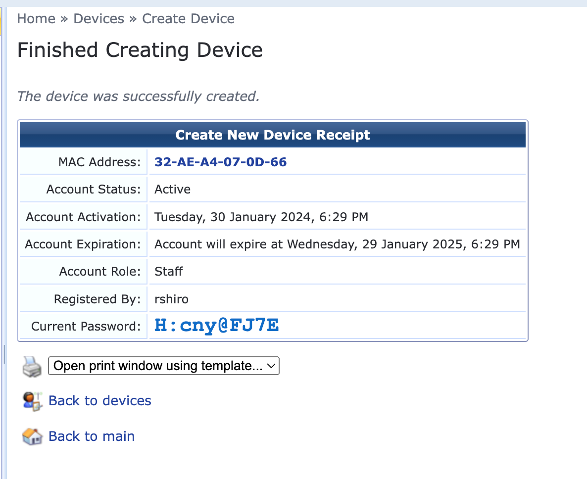
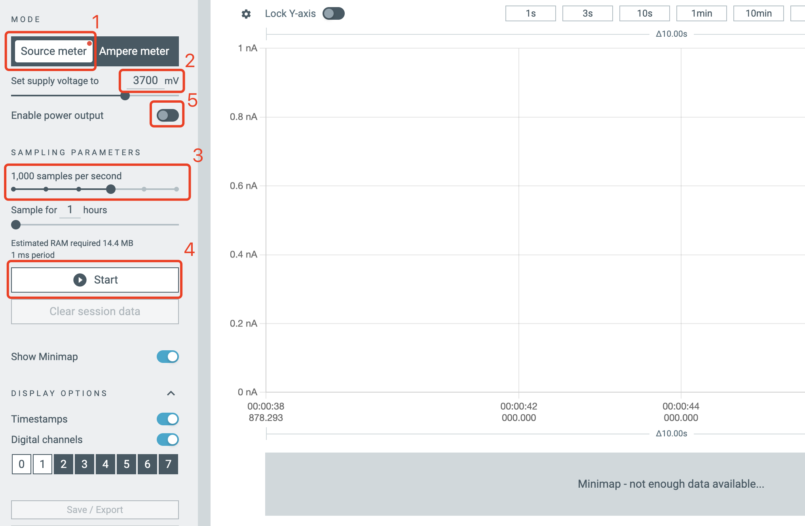
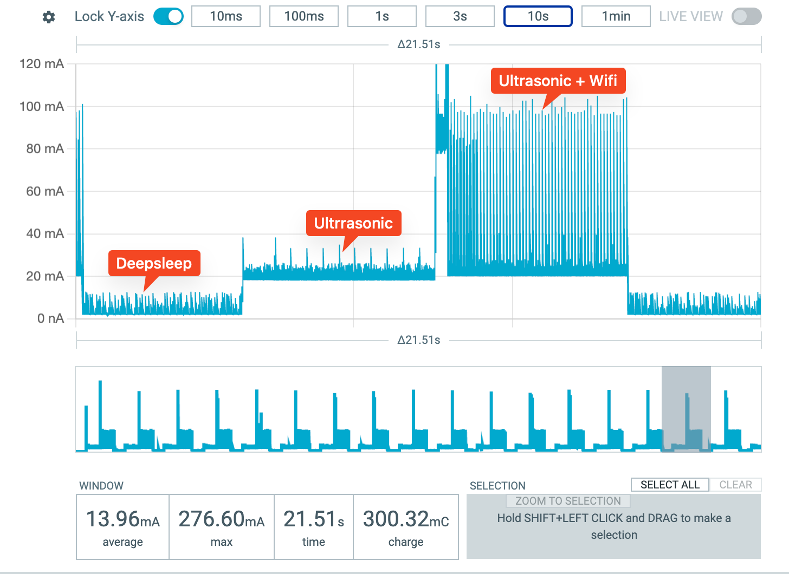

# Lab 5 - Power Management

## Lab Prerequisites

- ESP32 (x1)
- USB-C cable for ESP32 (x1)
- Power Profiler Kit II (one kit per group of 3)
- Micro-USB cable for Power Profiler Kit (one cable per group)
- HC-SR04 Ultrasonic Sensor (x1)
- Jumper Cables
- Breadboard

## **1. Find the MAC address of your ESP32**

These instructions are also located on this [website](https://randomnerdtutorials.com/get-change-esp32-esp8266-mac-address-arduino/)

```arduino
// Complete Instructions to Get and Change ESP MAC Address: https://RandomNerdTutorials.com/get-change-esp32-esp8266-mac-address-arduino/
#include <Arduino.h>
#include <WiFi.h>

void setup(){
  Serial.begin(115200);
  while(!Serial);
  delay(1000);
  Serial.println();
  Serial.print("ESP Board MAC Address:  ");
  Serial.println(WiFi.macAddress());
}
 
void loop(){
	Serial.println(WiFi.macAddress());
	delay(1000);
}
```

## 2. Configure your ESP32 to work on the UW MPSK WiFi network

Follow the instructions on UW’s IT Connect [website](https://itconnect.uw.edu/tools-services-support/networks-connectivity/uw-networks/campus-wi-fi/uw-mpsk/):



The output should look like this if the device was successfully generated.

## 3. Confirm that your ESP32 is connected to the UW MPSK wifi

```arduino
#include <WiFi.h>

const char* ssid     = "UW MPSK";
const char* password = "your_PASSWORD"; // Replace with your password received from UW MPSK

void setup() {
  Serial.begin(115200);
  while(!Serial);
  delay(1000);
  // Connect to WiFi
  WiFi.begin(ssid, password);
  Serial.print("Connecting to WiFi");
  while (WiFi.status() != WL_CONNECTED) {
    delay(1000);
    Serial.print(".");
  }
  Serial.println("");
  Serial.println("Connected to WiFi");
}

void loop() {
  // Test WiFi connection
  if(WiFi.status() == WL_CONNECTED) {
    Serial.println("WiFi is still connected");
  } else {
    Serial.println("WiFi connection lost");
  }
  
  delay(5000); // Wait for 5 seconds before checking again
}
```

## 4. Set up a Firebase account

Follow the instructions from **step 1 to 4** on the link [here](https://randomnerdtutorials.com/esp32-firebase-realtime-database/).

## 5. Download nRF Connect for Desktop and J-Link Configurator V7.88j (if you have not done so already)

Find the software on this [website](https://www.nordicsemi.com/Products/Development-tools/nRF-Connect-for-desktop/Download#infotabs) and then install the Power Profiler App to connect with the Power Profiler Kit (see image below). Also, install the J-LINK (**version V7.88j**) Configurator software. The link of downloading J-LINK is [here](https://www.segger.com/downloads/jlink/).

**Note: For Macs with Apple Silicon, use the `Universal Installer`**


After you install “Power Profiler,” open it to see the following interface:


## 6. Connect your ESP32 circuit to your Power Profiler Kit and view power consumption through the Power Profiler App

First, build a small circuit by connecting your ultrasonic sensor to your ESP32. Ensure that the sensor is working properly by printing the measured distance in your serial monitor.

Next, connect your ESP32 to the Power Kit, as shown in the figure below.

NOTE: Make sure that you first unplug your ESP32 from your computer before connecting it to the Power Kit.

The power kit will provide power to your ESP32 and ultrasonic sensor. Select the “USB DATA/POWER” port on the Power Profiler Kit. Turn the button on.


NOTE : You should connect your micro-USB into the `USB DATA/Power` port.

Next, turn on the Power Profiler App and select the Power Kit you just connected. Program the device if prompted.


Next, ensure that the settings on your Power Profiler App match the settings in the image below.

1. Choose source meter mode
2. Set the supply voltage to 5V
3. Set sample rate to 1000Hz
4. Click start
5. Enable power output



If everything is working properly, you should see a visualization of the measurement of power consumption, as the following figure shows (the values can be different). This visualization is the power consumption over time.



Take a screenshot of the power consumption visualization over one minute.

Annotate, like above, the key moments on the screenshot which depict the events which consume different amounts of power. These events are:

1. Idle ESP32 (not running WiFi or ultrasonic sensor)
2. Only ultrasonic sensor working
3. Ultrasonic + Wifi working
4. Ultrasonic + Wifi + Sending data to Firebase
5. Deep Sleep mode

## 7. Estimate the battery life for different use cases

Using the window duration selector at the top of the Power Profiler App, change the time window to 3 or 10 seconds. For each of the five power-consumption use cases described above, wait until the window is filled with only the power consumption curve that is unique to each use case.

Take a screenshot of the power consumption curve and the average power consumption for each use case.


A typical ‘[ADAFRUIT INDUSTRIES 1578 Lithium Ion Polymer Battery](https://www.adafruit.com/product/1578)’ has a capacity of 500mAh, which means that it can support a system running at 500 mA for 1 hour.

Estimate how long the battery would support each of the five use cases before dying. For example, if the average current is 50mA, then the battery can last for 10 hours (500mAh / 50mA = 10 hours).

Rewrite the Arduino code to transmit your ultrasonic sensor data to Firebase at the five following rates:

1. 2 times per second (2 Hz)
2. 1 time per second (1 Hz)
3. Once every 2 seconds (0.5 Hz)
4. Once every 3 seconds (0.333 Hz)
5. Once every 4 seconds (0.25 Hz)

Identify what the power consumption (i.e. average current) is for each of the five different data transmission rates. Plot a graph with Excel or Google Sheets to find the correlation between the data transmission rate and power consumption (i.e. average current).

Take a screenshot of your plot.

Estimate how long a 50mAh battery would support each of the five different data transmission rates.

## 8. Create your own power consumption guidelines for the ESP32 and ultrasonic sensor

Given the insights that you have gained thus far, create your own power consumption guidelines for a battery-powered device. This ESP32-enabled device must use an ultrasonic sensor to measure distance and transmit that distance data to Firebase. The device must operate for **24 hours** on a single 50mAh battery.

Assume that this device is designed to detect whether or not an object (or person) has moved in front of the ultrasonic sensor in a room. The results of that detection should be uploaded to the Firebase cloud database. Rewrite the Arduino code to develop new power consumption guidelines for this new device. There are several variables that you can change, including deep sleep duration and frequency, or the data transmission rate, among others. For example, you can develop a policy such as *“If the ultrasonic sensor’s readout is greater than 50cm for 30 seconds, turn the ESP32 to sleep mode for 30 seconds.”*

Upload the code onto your ESP32, reconnect the Power Profiler Kit, and take a screenshot of a 1-minute window of the power consumption visualization. Include the average current in the screenshot. Annotate any notable changes in current on the visualization, and summarize the guidelines you’ve developed.
